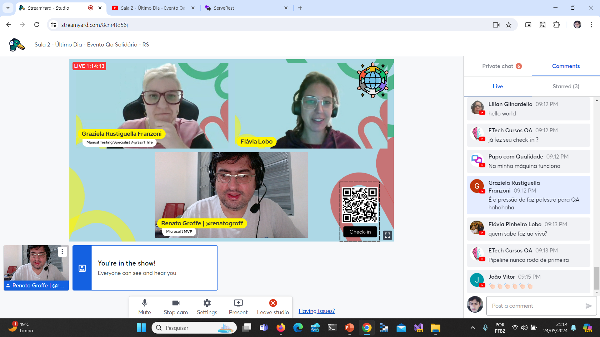
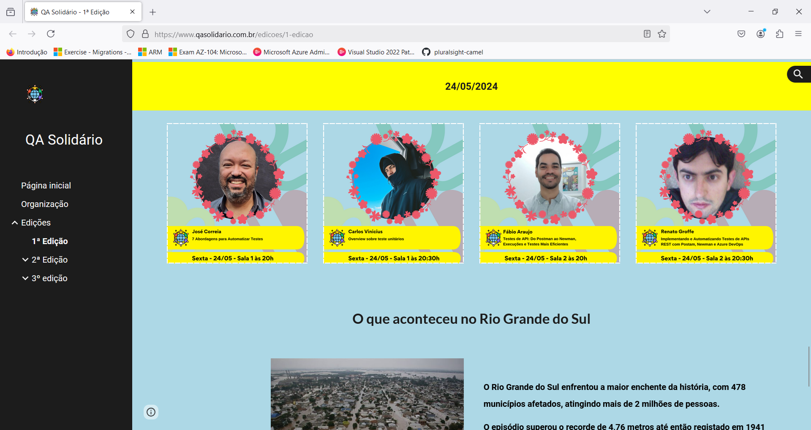

# kind_QASolidarioRS-2024-05

Exemplo de utilização de kind em testes com clusters Kubernetes localmente, além da automação de testes com esta tecnologia em um Pipeline do Azure DevOps e um workflow do GitHub Actions. Conteúdo apresentado durante o evento QA Solidário - RS em 24/05/2024.

Título da apresentação: **kind: Implementando e Automatizando Testes de Integração para Kubernetes**

Data: **24/05/2024 (sexta-feira)**

Tipo do evento: **Online**

Ferramenta de transmissão: **YouTube (via Streamyard)**

Tecnologias utilizadas: **Kubernetes, kind, Docker, Linux, Azure DevOps, Azure Pipelines, GitHub GitHub Actions, MongoDB, .NET, ASP.NET Core, Postman, Newman, npm**

Número de participantes: **17 pessoas (pico de audiência ao longo da live)**

Link do evento: [**Site**](https://www.qasolidario.com.br/edicoes/1-edicao)

Deixo aqui meus agradecimentos ao **Fábio Araújo**, à **Graziela Rustiguella Franzoni**, à **Flávia Lobo**, à **Marcia Marrocos** e demais organizadores por todo o apoio para que eu partipasse como palestrante do **Referências 2024**.

---

Outros prints podem ser encontrados neste [**diretório**](/img/).